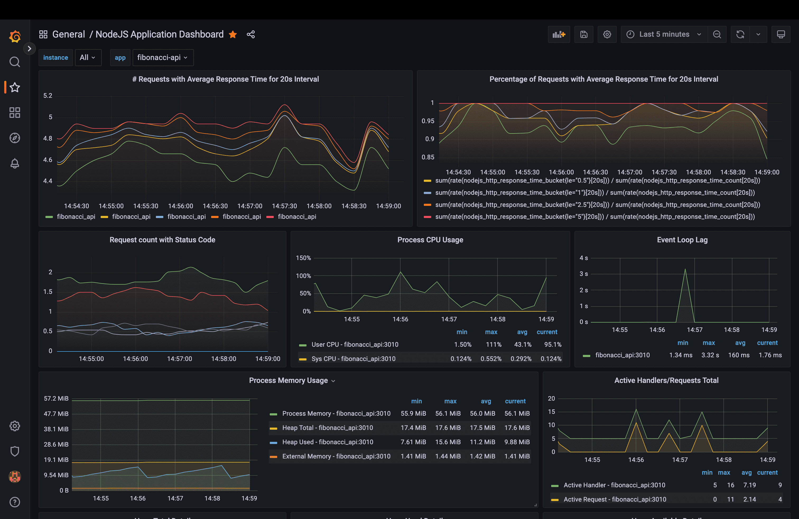

# Prometheus and Grafana for monitoring



- [Prometheus and Grafana for monitoring](#prometheus-and-grafana-for-monitoring)
  - [Setup](#setup)
  - [Manual Setup](#manual-setup)
    - [Install Prometheus](#install-prometheus)
    - [Install Graphana](#install-graphana)
  - [Adding Prometheus as data source](#adding-prometheus-as-data-source)
  - [Creating the dashboard](#creating-the-dashboard)
  - [Setup Server](#setup-server)
  - [Resources](#resources)


## Setup

1. Create a `data` directory at the root of the project.

2. Inside the `data` directory, create `grafana` and `prometheus` directories for persistent storage.

3. Use the command `docker-compose up -d` to start the container with all the tools.  
Grafana should be available at http://localhost:3030  
The default `username` and `password` both are `admin`.  
Provisioned datasource and dashboard are already added for you but you can add them manually too.  
Follow the steps below to [add Prometheus as a data source](#adding-prometheus-as-data-source) inside Grafana.  
Also follow the steps [to add a nodejs dashboard](#creating-the-dashboard) to Grafana.  

1. Server should be available at http://localhost:3011.  
Follow the steps below to use the script to send traffic to the server.


## Manual Setup
----

### Install Prometheus

```bash
docker run \        
    -p 9090:9090 \
    -v ./prometheus.yml:/etc/prometheus/prometheus.yml \
    prom/prometheus
```

Inside `prometheus.yml` config, you will have to update `target` under `fibonacci_api` job configuration to something like `host.docker.internal:3010` with the correct port number where your nodejs app will provide metrics.

Prometheus should be up and running on http://localhost:9090

Find more here: https://prometheus.io/docs/prometheus/latest/installation/


### Install Graphana

```bash
docker run -d --name=grafana -p 3030:3000 grafana/grafana-enterprise
```

Grafana should be available at http://localhost:3030  
The default `username` and `password` both are `admin`.  

Find more here: https://grafana.com/docs/grafana/latest/setup-grafana/configure-docker/  
More useful docs for using with docker-compose:  
https://grafana.com/docs/grafana-cloud/quickstart/docker-compose-linux/  


## Adding Prometheus as data source
----

Go to http://localhost:3030/datasources and click on `Add data source` button.  
Then select Prometheus from the given menu.

* For manual setup  
Find the IP address of the prometheus container.
Add the URL `http://<IP Address>:9090` (e.g., `http:170.30.0.0:9090`)

* When using `docker-compose`  
We can use static address for URL: `http://prometheus:9090`

Click on `Save & test`.

The data source should be added.


## Creating the dashboard
----


You can import a pre-built dashboard for nodejs processed from here:  
https://grafana.com/grafana/dashboards/11159-nodejs-application-dashboard/  

Or you can import the dashboard I created from `server/nodejs-dashboard.json`.

## Setup Server
----

From the container, server is available at http://localhost:3011.

We can use the existing script to simulate different type of traffic to the server.  

We first need to install dependencies to run the script.  
Use the commands below and it will start the script.  
```
cd server
npm i
node generateRandomRequests.js
```
This will send uniform traffic to the server. You can tweak the configs to see different result.  

To send the unusual amount of traffic, run the script with the number of requests you want.  
```
node generateRandomRequests.js 1000
```

## Resources

* [Query Functions](https://prometheus.io/docs/prometheus/latest/querying/functions/#functions)
* [Histogram & Summaries](https://prometheus.io/docs/practices/histograms/#count-and-sum-of-observations)