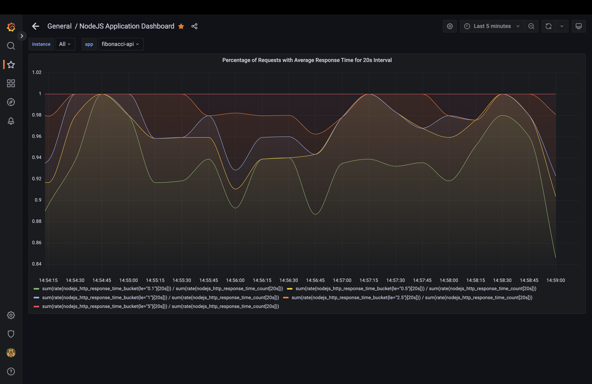
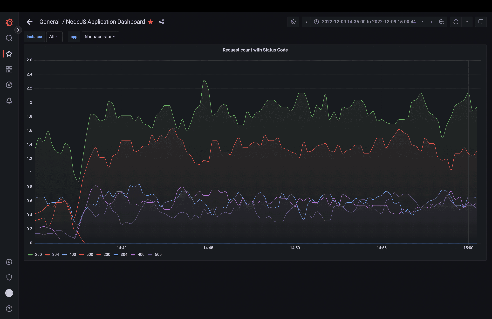

# Monitor Nodejs App with Prometheus and Grafana

## Complete Dashboard

## Percentile of requests with Response Time

## Number of requests with Response Time

## Number of requests per second with Status Code
